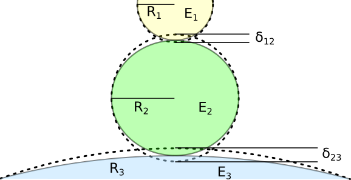
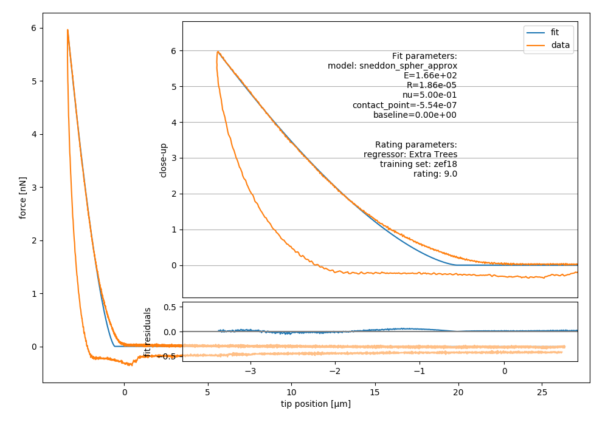

.. _sec_fitting:

=============
Fitting guide
=============

This is a summary of the methods used by nanite for fitting
force-distance data. Examples are given below.

.. _sec_fitting_preproc:

Preprocessors
=============
Prior to data analysis, a force-distance curve has to be preprocessed.
One of the most important preprocessing steps is to perform a
tip-sample separation which computes the correct tip position from the
recorded piezo height and the cantilever deflection. Other preprocessing
steps correct for offsets or smoothen the data:

.. nanite_preproc_table::

Several methods for estimating the point of contact (POC) are implemented in
nanite:

.. nanite_preproc_poc_table::

.. _sec_fitting_models:

Models
======
Nanite comes with a predefined set of model functions that are
identified (in scripting as well as in the command line interface)
via their model keys.

.. nanite_model_table::

These model functions can be used to fit experimental force-distance
data that have been preprocessed as described above.

.. _sec_fitting_params:

Parameters
==========
Besides the modeling parameters (e.g. Young's modulus or contact point),
nanite allows to define an extensive set of fitting options, that
are described in more detail in :class:`nanite.fit.IndentationFitter`.

.. csv-table::
    :header: parameter, description
    :delim: ;

    model_key; Key of the model function used
    optimal_fit_edelta; Plateau search for Young's modulus
    optimal_fit_num_samples; Number of points for plateau search
    params_initial; Initial parameters
    preprocessing; List of preprocessor keys
    range_type; 'absolute' for static range, 'relative cp' for dynamic range
    range_x; Fitting range (min/max)
    segment; Which segment to fit ('approach' or 'retract')
    weight_cp; Suppression of residuals near contact point
    x_axis; X-data used for fitting (defaults to 'top position')
    y_axis; Y-data used for fitting (defaults to 'force')
    method; Minimizer method for `lmfit.minimize <https://lmfit.github.io/lmfit-py/fitting.html#lmfit.minimizer.minimize>`_
    method_kws; Additional arguments (`fit_kws`) for the underlying scipy minimizer function

.. _sec_fitting_gcfk:

Geometrical correction factor
=============================
The basic models implemented in nanite are all *single-contact* models, which
means that they assume there is *only one* indentation taking place during a
measurement. In an AFM experiment, this holds true for e.g. measuring a
flat hydrogel with a spherical AFM tip. However, many experiments require
a *two-contact* model. A prominent example is the indentation of an
elastic sphere between two parallel plates (e.g. a round cell on a glass
cover slip indented by a wedged cantilever). Here, the top *and* bottom
indentation of the sphere contribute to the overall indentation. However,
the forces required to indent either side of the sphere are identical to the
force in the *single-contact* version of the problem (where the elastic
sphere *is* the cantilever). For instance, you need twice the force to squeeze
a ball between your hands compared to when you squeeze it against a wall, but
the overall indentation stays the same (Newton's third law). Thus, when you
use a *single-contact* model in a *two-contact* problem, you have to be aware
of the fact that the actual indentation may be larger. For the simple example
of parallel-plate compression, the actual indentation is doubled. Thus, to
be able to apply the single-contact model fit, we have to multiply the
measured indentation by a factor of :math:`k=0.5`.

    Two-contact geometry for three elastic spheres.

Let's take a look at the more general geometric problem (still neglecting
adhesion forces and gravity). Let's assume whe have three spheres with
Young's modul :math:`E_1`, :math:`E_2`, :math:`E_3` and radii :math:`R_1`,
:math:`R_2`, :math:`R_3` (see figure :numref:`fitting_geometry`). This is
a two-contact problem. For each of the contact areas we can write down the
:ref:`Hertz model <sec_ref_model_hertz_para>` for the single-contact problem. The overall indentation is
:math:`\delta = \delta_{12} + \delta_{23}` with

.. math::

    \delta_{12} = \left(\frac{3F}{4E_{12}} \cdot \frac{1}{\sqrt{R_{12}}} \right)^{2/3}

    \delta_{23} = \left(\frac{3F}{4E_{23}} \cdot \frac{1}{\sqrt{R_{23}}} \right)^{2/3}

and

.. math::

    \frac{1}{R_{ij}} &= \frac{1}{R_{i}} + \frac{1}{R_{j}}

    \frac{1}{E_{ij}} &= \frac{1-\nu_i^2}{E_{i}} + \frac{1-\nu_j^2}{E_{j}}.

From here, we can start simplifying. Let's say the indenter and the substrate
are comparatively stiff (:math:`E_1 = E_3 >> E_2`) and the substrate is flat
(:math:`R_3 \rightarrow \inf`). Then we get

.. math::

    \delta_{12} &= \left(\frac{3F (1-\nu_2^2)}{4E_{2}} \cdot \frac{1}{\sqrt{R_{12}}} \right)^{2/3}

    \text{and}~~ \delta_{23} &= \left(\frac{3F (1-\nu_2^2)}{4E_{2}} \cdot \frac{1}{\sqrt{R_{2}}} \right)^{2/3}.

Thus, the overall indentation becomes

.. math::

    \delta = \left(\frac{3F (1-\nu_2^2)}{4E_{2}} \right)^{2/3}
             \left( \frac{1}{R_{12}^{1/3}} + \frac{1}{R_{2}^{1/3}} \right).

Finally, we arrive at

.. math::

    \delta &= \left( \frac{3F (1-\nu_2^2)}{4E_2} \frac{1}{\sqrt{R_{12}}} \right)^{2/3} \cdot \frac{1}{k}

    \text{with}~~ k &= \frac{R_{2}^{1/3}}{R_2^{1/3} + R_{12}^{1/3}}.

The parameter :math:`k` is the geometrical correction factor. For an indenter
with :math:`R_1 = 2.5\,\text{µm}` and a cell with :math:`R_2 = 7.5\,\text{µm}`,
the geometrical correction factor computes to :math:`k=0.6135`. Note that during
fitting with the single-contact model, you now have to set the radius to
the effective radius :math:`R_{12}=1.875\,\text{µm}`.

For a more general description of this problem, please have a look at
:cite:`Glaubitz2014`.

Workflow
========
There are two ways to fit force-distance curves with nanite: via the
:ref:`command line interface (CLI) <sec_cli>` or via Python scripting. The
CLI does not require programming knowledge while Python-scripting allows
fine-tuning and straight-forward automation.

.. _sec_fit_workflow:

Command-line usage
------------------
First, set up a fitting profile by running (e.g. in a command prompt
on Windows).

.. code::

    nanite-setup-profile

This program will ask you to specify preprocessors, model parameters, and
other fitting parameters. Simply enter the values via the keyboard and hit
enter to let them be acknowledged. If you want to use the default values,
simply hit enter without typing anything. A typical output will look like this:

.. code::

    Define preprocessing:
      1: compute_tip_position
      2: correct_force_offset
      3: correct_split_approach_retract
      4: correct_tip_offset
      5: smooth_height
    (currently '1,2,4'): 
    
    Select model number:
      1: hertz_cone
      2: hertz_para
      3: hertz_pyr3s
      4: sneddon_spher
      5: sneddon_spher_approx
    (currently '5'): 

    Set fit parameters:
    - initial value for E [Pa] (currently '3000.0'): 50 
      vary E (currently 'True'): 
    - initial value for R [m] (currently '1e-5'): 18.64e-06
      vary R (currently 'False'): 
    - initial value for nu (currently '0.5'): 
      vary nu (currently 'False'): 
    - initial value for contact_point [m] (currently '0.0'): 
      vary contact_point (currently 'True'): 
    - initial value for baseline [N] (currently '0.0'): 
      vary baseline (currently 'False'): 
    
    Select range type (absolute or relative):
    (currently 'absolute'): 
    
    Select fitting interval:
    left [µm] (currently '0.0'): 
    right [µm] (currently '0.0'): 
    
    Suppress residuals near contact point:
    size [µm] (currently '0.5'): 2

    Select training set:
    training set (path or name) (currently 'zef18'): 

    Select rating regressor:
      1: AdaBoost
      2: Decision Tree
      3: Extra Trees
      4: Gradient Tree Boosting
      5: Random Forest
      6: SVR (RBF kernel)
      7: SVR (linear kernel)
    (currently '3'):

    Done. You may edit all parameters in '/home/user/.config/nanite/cli_profile.cfg'.

In this example, the only modifications of the default values are
the initial value of the Young's modulus (50 Pa),
the value for the tip radius (18.64 µm),
and the suppression of residuals near the contact point with a ±2 µm interval.
When ``nanite-setup-profile`` is run again, it will use the values from the
previous run as default values. The training set and rating regressor
options are discussed in the :ref:`rating workflow <sec_rating>`.

Finally, to perform the actual fitting, use the command-line script

.. code::

    nanite-fit data_path output_path

This command will recursively search the input folder ``data_path`` for
data files, fit the data with the parameters in the profile, and write the
statistics (*statistics.tsv*) and visualizations of the fits
(multi-page TIFF file *plots.tif*, open with `Fiji <https://fiji.sc>`_
or the Windows Photo Viewer) to the directory ``output_path``. 

.. _fig-nanite-fit-example:

    Example image generated with ``nanite-fit``. Note that the dataset
    is already rated with the default method "Extra Trees" and the
    default training set label "zef18". See :ref:`sec_rating` for more
    information on rating.

Scripting usage
---------------

Using nanite in a Python script for data fitting is straight forward.
First, load the data; ``group`` is an instance of
:class:`nanite.IndentationGroup`:

.. ipython::

    In [1]: import nanite

    In [2]: group = nanite.load_group("data/force-save-example.jpk-force")

Second, obtain the first :class:`nanite.Indentation` instance and apply
the preprocessing:

.. ipython::

    In [3]: idnt = group[0]

    In [4]: idnt.apply_preprocessing(["compute_tip_position",
       ...:                           "correct_force_offset",
       ...:                           "correct_tip_offset"])

Now, setup the model parameters:

.. ipython::

    In [5]: idnt.fit_properties["model_key"] = "sneddon_spher"

    In [6]: params = idnt.get_initial_fit_parameters()

    In [7]: params["E"].value = 50

    In [8]: params["R"].value = 18.64e-06

    In [9]: params.pretty_print()

Finally, fit the model:

.. ipython::

    In [10]: idnt.fit_model(model_key="sneddon_spher", params_initial=params, weight_cp=2e-6)

    In [11]: idnt.fit_properties["params_fitted"].pretty_print()

The fitting results are identical to those shown in
:numref:`figure %s above <fig-nanite-fit-example>`.

Note that, amongst other things, preprocessing can also be specified
directly in the
:func:`fit_model <nanite.indent.Indentation.fit_model>` function.
