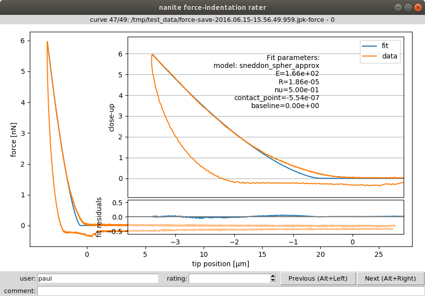

.. _sec_rating:

===============
Rating workflow
===============
One of the main aims of nanite is to simplify data analysis by sorting out
bad curves automatically based on a user defined rating scheme.
Nanite allows to automate the rating process using machine learning,
based on `scikit-learn <http://scikit-learn.org/>`_.
In short, an estimator is trained with a sample dataset that was manually
rated by a user. This estimator is then applied to new data and, in an
optimal scenario, reproduces the rating scheme that the user intended
when he rated the training dataset. For a more detailed analysis, please
refer to :cite:`Mueller19nanite`.

Nanite already comes with a default training set that is based on AFM
data recorded for zebrafish spinal cord sections, called `zef18`.
The original zef18 dataset is available online :cite:`zef18`.
Download links: [1]_

- https://ndownloader.figshare.com/files/13481393
- https://zenodo.org/record/1551200/files/zef18.h5
- https://b2share.eudat.eu/api/files/bf481c9b-14ff-47b1-baf5-e569d0199be6/zef18.h5

With nanite, you can also create your own training set. The required steps
to do so are described in the following.

Rating experimental data manually
=================================
In the rating step, experimental data are fitted and manually rated by the
user. The raw data, the preprocessed data, the fit, all parameters, and
the manual rating are then stored in a rating container (an HDF5 file).

First, set up a fitting profile using
:ref:`nanite-setup-profile <sec_cli_setup_profile>` if you have not already
done so in the :ref:`fitting guide <sec_fit_workflow>`. You can run
the command ``nanite-setup-profile`` again to verify that all settings
are correct.

To start manual rating, use the command :ref:`nanite-rate <sec_cli_rate>`.
The first argument is a folder containing experimental force-distance
curves and the second argument is a path to a rating container (``nameXY.h5``).
If the rating container already exists, new data will be appended (nothing is
overridden).

.. code::

    nanite-rate path/to/data/directory path/to/nameXY.h5

This will open a graphical user interface that displays the preprocessed
and fitted experimental data:

.. _fig-nanite-rate-example:

    Graphical user interface (GUI) for rating. The inset shows a close-up of
    the indentation part and the fitted parameters. The user name (defaults
    to login name) is used to assign a rating to a user (not mandatory).
    The rating (integer from 0/bad to 10/good or -1/invalid)
    and a comment can be defined for each curve. The shortcuts ``ALT+Left``
    and ``ALT+Right`` can be used to navigate within the dataset while keeping
    the cursor focused in the *rating* field. While navigating, the data
    are stored in the rating container and the GUI can be closed without
    data loss. 

For the subsequent steps, it is irrelevant whether you create many small
rating containers or one global rating container. Many small containers
have the advantage that the effect of individual rating sessions could be
analyzed separately, while a global rating container keeps all data in one
place.
 

Generating the training set
===========================
The training set consists only of the samples (features of each
force-distance curve) and the manual ratings. It is stored as
a set of small text files on disk. As described earlier, nanite comes with
the predefined *zef18* training set. In this step, a user-defined
training set will be generated for use with nanite.

Use the command
:ref:`nanite-generate-trainining-set <sec_cli_generate_training_set>` to
convert the rating container(s) to a training set:

.. code:: bash

    nanite-generate-trainining-set path/to/nameXY.h5 path/to/training_set/

This will create the folder ``path/to/training_set/ts_nameXY`` containing
several text files, one for each feature and one for the manual rating.

Applying the training set
=========================
To apply the training set when rating curves with ``nanite-fit``, you will
have to update the profile using ``nanite-setup-profile`` again (see
:ref:`fitting guide <sec_fitting>`). The relevant program output will
look like this:

.. code::

    [...]

    Select training set:
    training set (path or name) (currently 'zef18'): path/to/training_set/ts_nameXY

    Select rating regressor:
      1: AdaBoost
      2: Decision Tree
      3: Extra Trees
      4: Gradient Tree Boosting
      5: Random Forest
      6: SVR (RBF kernel)
      7: SVR (linear kernel)
    (currently '3'):

    Done. You may edit all parameters in '/home/user/.config/nanite/cli_profile.cfg'.

When running ``nanite-fit data_path output_path`` now, the new training
set is used for rating. The new ratings are stored in
``output_path/statistics.tsv`` and can be used for further analysis,
e.g. quality assessment or sorting.

If you would like to employ a user-defined training set in a Python script,
you may do so by specifying the training set path as an argument to
:func:`nanite.Indentation.rate_quality <nanite.indent.Indentation.rate_quality>`.
 
.. [1] The SHA256 checksum of `zef18.h5` is
       63d89a8aa911a255fb4597b2c1801e30ea14810feef1bb42c11ef10f02a1d055.
